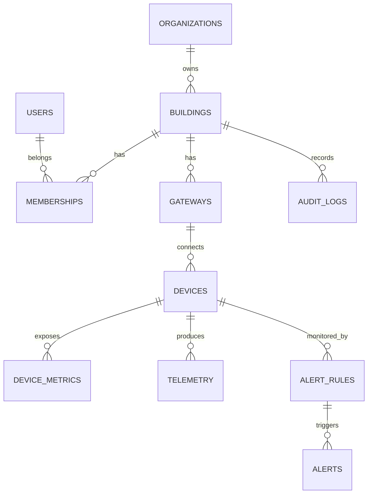

# Modelo de dados — Prédio ON

## ERD simplificado

## Tabelas

| Tabela | Finalidade |
|---|---|
| `users` | Usuários da plataforma |
| `organizations` | Clientes/organizações |
| `buildings` | Prédios/condomínios |
| `memberships` | Vínculo e papel do usuário no prédio |
| `gateways` | Gateway físico instalado no prédio |
| `devices` | Sensores e monitores conectados |
| `device_metrics` | Métricas expostas por cada dispositivo |
| `ingest_events` | Idempotência da ingestão MQTT |
| `telemetry` | Série temporal de medições |
| `alert_rules` | Regras configuráveis de limite |
| `alerts` | Ocorrências geradas pelas regras |
| `audit_logs` | Auditoria de ações administrativas |

## Multi-tenancy

A coluna `building_id` é a principal fronteira de isolamento. A API aplica RBAC e o PostgreSQL usa RLS como segunda camada de segurança.

## Telemetria

`telemetry` é transformada em hypertable do TimescaleDB. O valor original fica em `value` e, quando numérico, também em `numeric_value` para consultas de limiar/agregação.

## Idempotência

MQTT QoS 1 pode entregar a mesma mensagem mais de uma vez. Antes de gravar a série temporal, o ingest tenta registrar `event_id` em `ingest_events`; se o ID já existir, a mensagem duplicada é descartada.

## Alertas

As regras ficam em `alert_rules`, com operador, limiar, severidade e cooldown. Quando uma medição atende à condição, o sistema cria uma linha em `alerts`.

## Escala

A estrutura permite crescer horizontalmente no backend e ingest, mantendo o broker desacoplado e usando TimescaleDB para alto volume temporal.
