# Imagens reais dos aplicativos e portais

Publicadas em **03/10/2026**. Estas capturas foram conferidas em execuções reais e usam dados fictícios. Cada imagem mantém o commit de origem; a data de publicação não altera a versão demonstrada. O plano completo e os cinco vídeos finais continuam pendentes, conforme [CONTINUIDADE.md](CONTINUIDADE.md).

As dezenove imagens e a [galeria HTML](IMAGENS_DOS_SISTEMAS.html) agora acompanham o clone. Abra a galeria no navegador para filtrar e ampliar. O [manifesto](imagens/2026-10-03/manifesto.json) registra dimensões, SHA-256 e origem.

## Android — Morador: avisos

Origem: [`f622949`](https://github.com/helberjf/predioON/commit/f62294935cc3005b5bc1bd287831bf48a2fb1276). Emulador Android com API/banco de teste; homologação em aparelho e todos os domínios continuam pendentes.

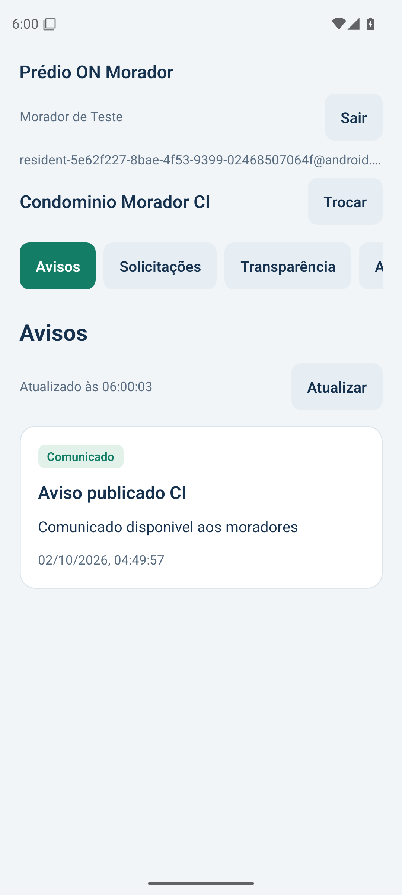

## Android — Morador: reserva confirmada

Origem: [`42f2130`](https://github.com/helberjf/predioON/commit/42f2130ac35fc15043c3b4f0fc8d1dbda7b06a24). Emulador Android com API/banco de teste; homologação em aparelho e todos os domínios continuam pendentes.

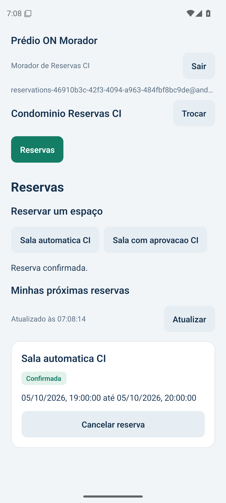

## Android — Operação: resumo

Origem: [`f622949`](https://github.com/helberjf/predioON/commit/f62294935cc3005b5bc1bd287831bf48a2fb1276). Emulador Android com API/banco de teste; homologação em aparelho e todos os domínios continuam pendentes.

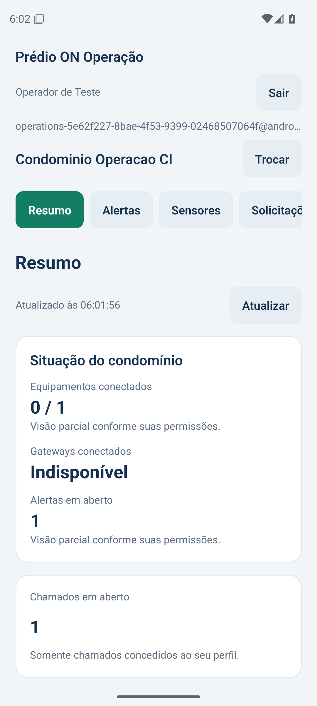

## Web — Administração

Origem: [`5eda20e`](https://github.com/helberjf/predioON/commit/5eda20e9778593ead30a2334a494570e6720eddb). Captura web de Chromium com API real e banco descartável; não comprova funcionalidades posteriores.

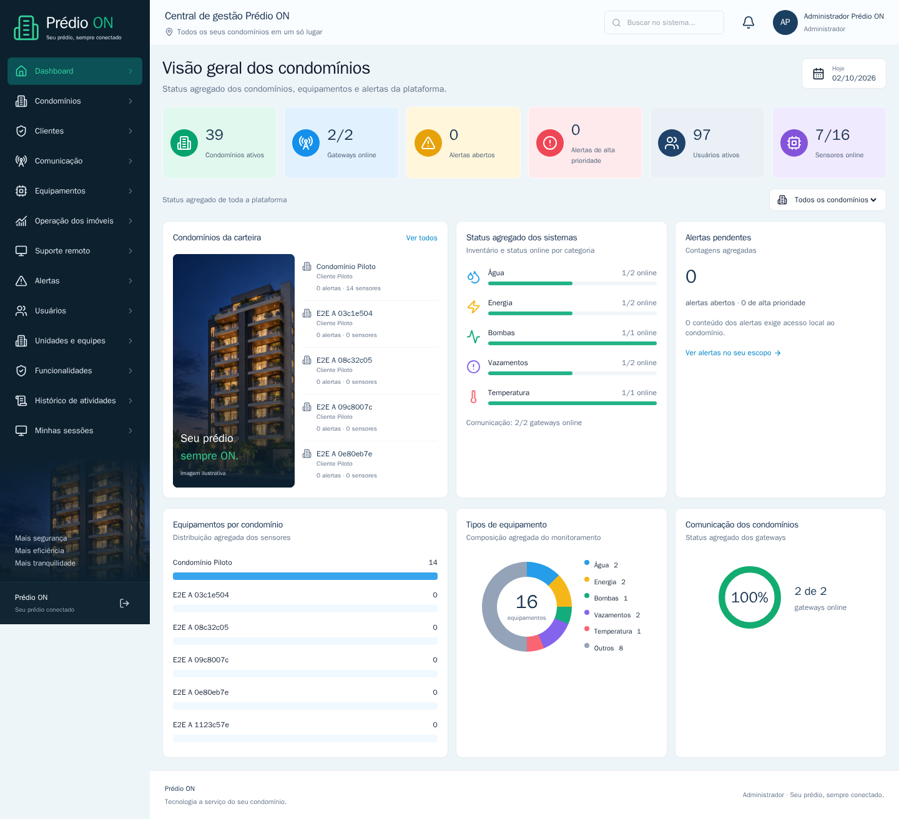

## Web — Síndico

Origem: [`5eda20e`](https://github.com/helberjf/predioON/commit/5eda20e9778593ead30a2334a494570e6720eddb). Captura web de Chromium com API real e banco descartável; não comprova funcionalidades posteriores.

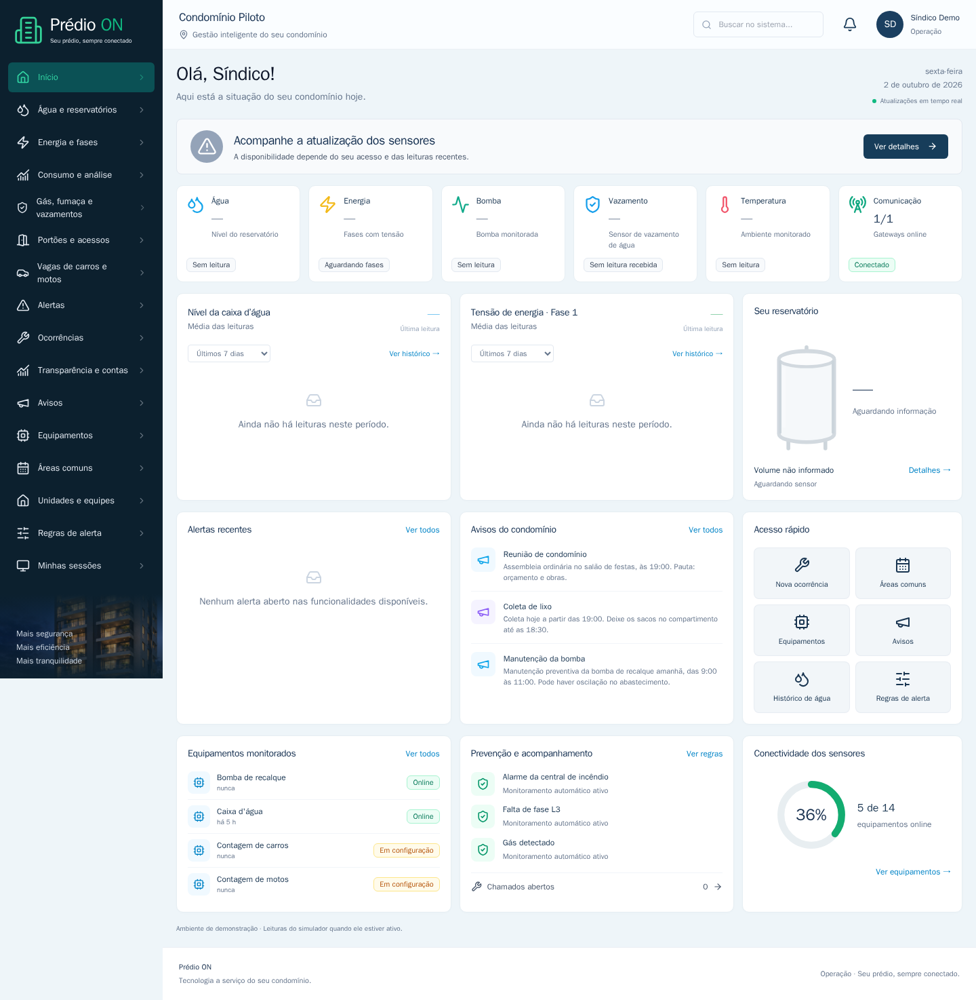

## Web — Morador

Origem: [`5eda20e`](https://github.com/helberjf/predioON/commit/5eda20e9778593ead30a2334a494570e6720eddb). Captura web de Chromium com API real e banco descartável; não comprova funcionalidades posteriores.

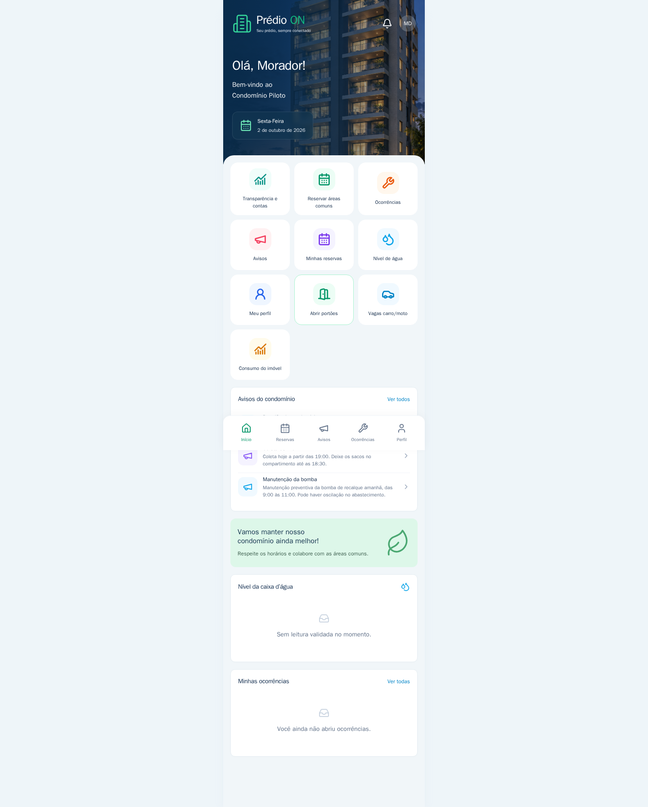

## iOS — Morador: entrada

Origem: [`b4726b9`](https://github.com/helberjf/predioON/commit/b4726b97c7a1384d836ec84a8c265fe002bd951e). Inicialização e novo processo em iPhone 16 Pro/iOS 18.5; login e jornadas autenticadas ainda pendentes.

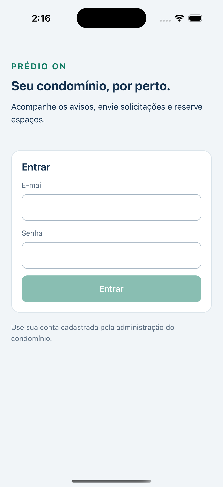

## iOS — Operação: entrada

Origem: [`b4726b9`](https://github.com/helberjf/predioON/commit/b4726b97c7a1384d836ec84a8c265fe002bd951e). Inicialização e novo processo em iPhone 16 Pro/iOS 18.5; login e jornadas autenticadas ainda pendentes.

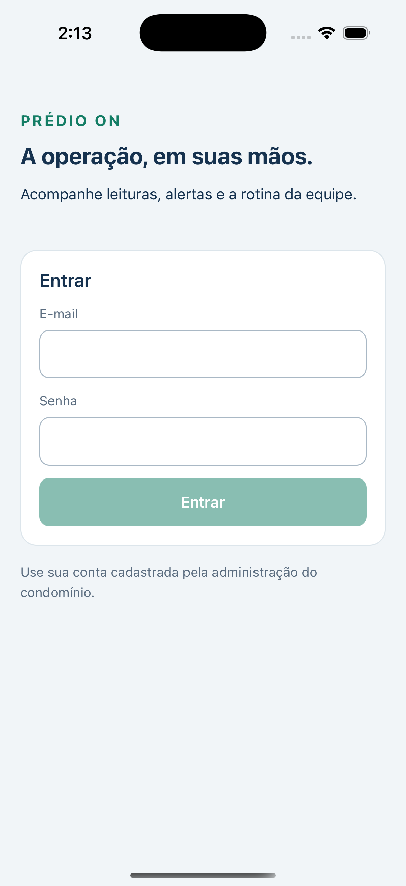

## Web — Auditoria global

Origem: [`c2871f0`](https://github.com/helberjf/predioON/commit/c2871f0b1fd9c9039bb5240100b256841df8bd12). Histórico autorizado da plataforma, sem metadata, IP ou user-agent. Captura real de Chromium com API036 e banco descartável; dados fictícios. A fonte dos16 arquivos testados foi conferida contra este commit; a captura local precedeu sua publicação, com os mesmos arquivos.

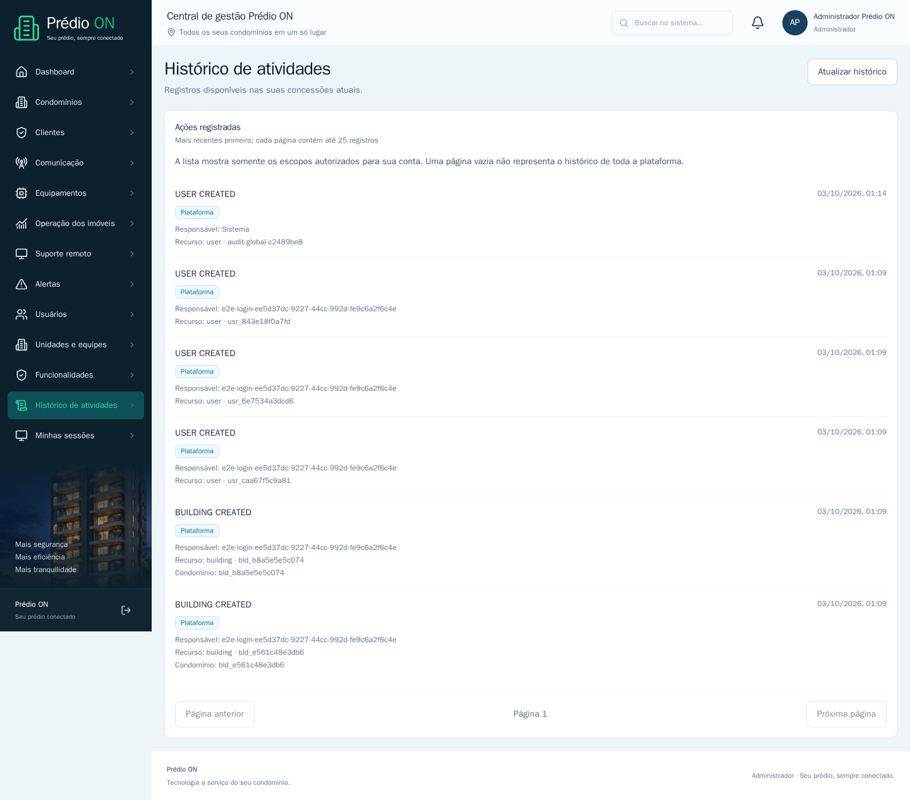

## Web — Auditoria do condomínio

Origem: [`c2871f0`](https://github.com/helberjf/predioON/commit/c2871f0b1fd9c9039bb5240100b256841df8bd12). Histórico local com25 registros por página e viewport390px. É o portal web responsivo, com API036 real; não é uma captura nativa de Android ou iOS. A fonte dos16 arquivos testados foi conferida contra este commit; a captura local precedeu sua publicação, com os mesmos arquivos.

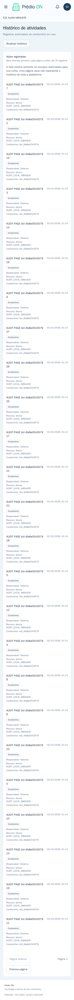

## Android — Morador · Contas publicadas

Origem: [8408a5d](https://github.com/helberjf/predioON/actions/runs/37130882267), artefato11276742968, APK release x86_64 com API/PostgreSQL reais e dados fictícios. Prestação publicada com total e acesso aos lançamentos. Fase04 aprovada; percurso completo falhou mais tarde na revogação da Operação. Esta captura parcial não homologa toda a jornada nem aparelho físico.

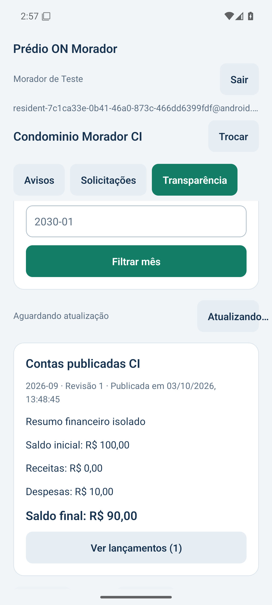

## Android — Operação · Alerta reconhecido

Origem: [8408a5d](https://github.com/helberjf/predioON/actions/runs/37130882267), artefato11276742968, APK release x86_64 com API/PostgreSQL reais e dados fictícios. Reconhecimento confirmado na interface e nas provas de ações do banco. Fase06 aprovada; percurso completo falhou mais tarde na verificação de conteúdo revogado. Esta captura parcial não homologa toda a jornada nem aparelho físico.

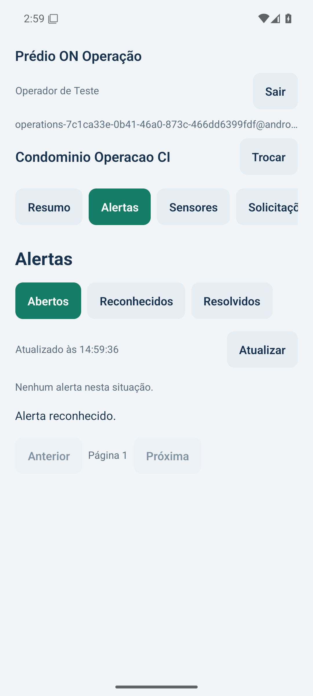

## Web — Administração · Segurança da conta

Fonte037 [057722b](https://github.com/helberjf/predioON/commit/057722bd61d3466516e5eb0eec8527c485fdd5b9), com23 arquivos comparados por SHA-256 LF. Formulário real com campos vazios protegidos, confirmação e cancelamento. API/PostgreSQL reais, contas fictícias isoladas e captura revisada; não é gravação final. A matriz funcional separada passou222/222 nos três motores, sem retries. No Morador, a rolagem nativa deixa o formulário inteiro acima da navegação fixa; nenhum elemento foi removido ou alterado para a imagem.

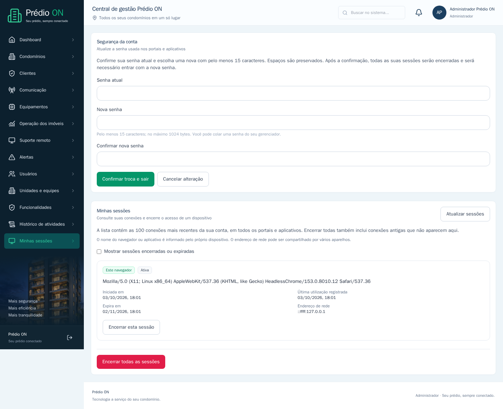

## Web — Síndico · Segurança da conta

Fonte037 [057722b](https://github.com/helberjf/predioON/commit/057722bd61d3466516e5eb0eec8527c485fdd5b9), com23 arquivos comparados por SHA-256 LF. Formulário real com campos vazios protegidos, confirmação e cancelamento. API/PostgreSQL reais, contas fictícias isoladas e captura revisada; não é gravação final. A matriz funcional separada passou222/222 nos três motores, sem retries. No Morador, a rolagem nativa deixa o formulário inteiro acima da navegação fixa; nenhum elemento foi removido ou alterado para a imagem.

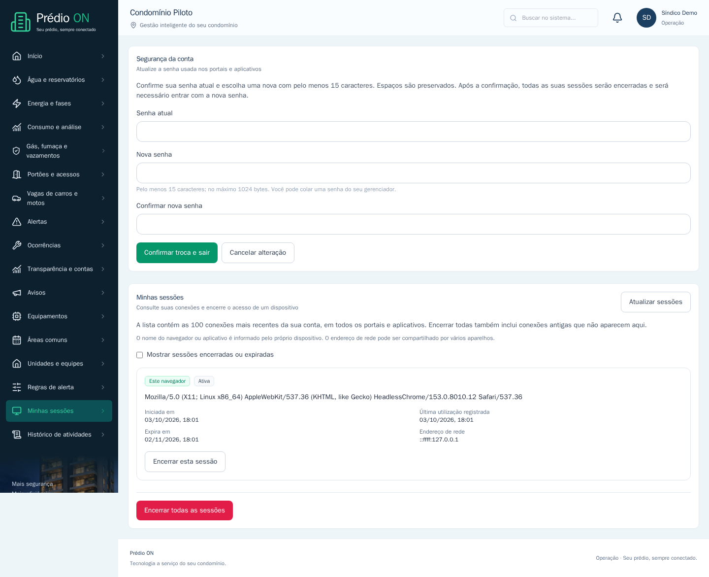

## Web — Morador · Segurança da conta

Fonte037 [057722b](https://github.com/helberjf/predioON/commit/057722bd61d3466516e5eb0eec8527c485fdd5b9), com23 arquivos comparados por SHA-256 LF. Formulário real com campos vazios protegidos, confirmação e cancelamento. API/PostgreSQL reais, contas fictícias isoladas e captura revisada; não é gravação final. A matriz funcional separada passou222/222 nos três motores, sem retries. No Morador, a rolagem nativa deixa o formulário inteiro acima da navegação fixa; nenhum elemento foi removido ou alterado para a imagem.

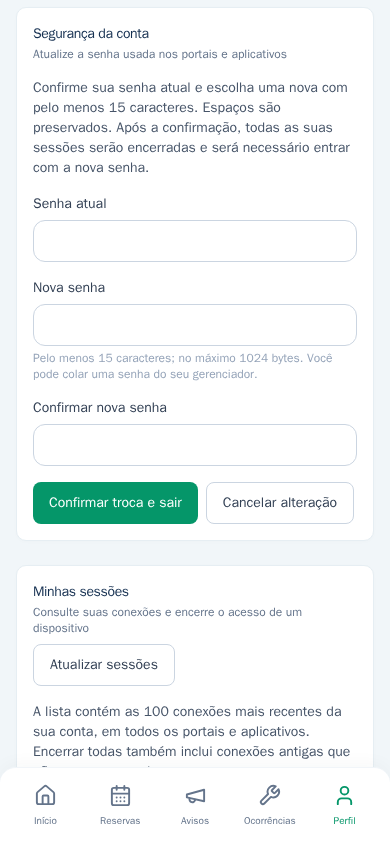

## Web — Síndico · Prestação publicada

Captura manual real no navegador desta máquina, API e banco demonstrativo com37 migrations. Rascunho privado e publicação foram verificados entre Síndico e Morador; saldo inicial R$123,45 menos despesa R$23,45 resultou R$100,00. Dados exclusivamente fictícios, sem pagamento real. Fonte [580a236](https://github.com/helberjf/predioON/commit/580a23608f4f79df3f9728946be4bfdb993155bb), com198 arquivos de runtime comparados ao commit e hashes dos bundles no [registro](imagens/2026-10-03/web-finance-manual-evidence.json). O screenshot retornou JPEG; bytes preservados, sem conversão ou edição. Viewport real1280×720, captura da página inteira; não é teste de390px nem app nativo.

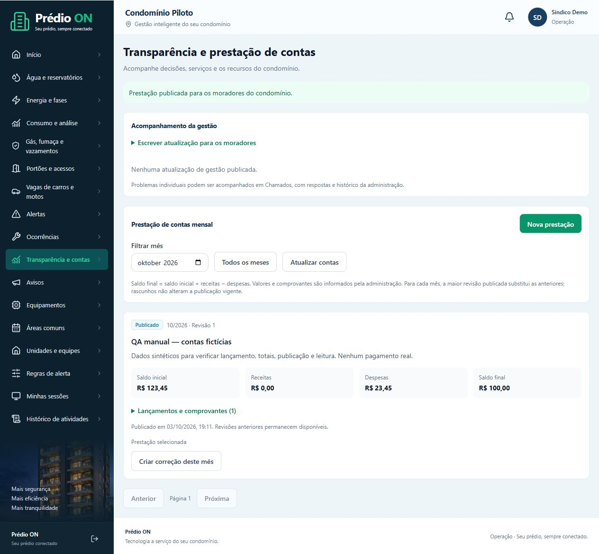

## Web — Morador · Prestação publicada

Captura manual real no navegador desta máquina, API e banco demonstrativo com37 migrations. Rascunho privado e publicação foram verificados entre Síndico e Morador; saldo inicial R$123,45 menos despesa R$23,45 resultou R$100,00. Dados exclusivamente fictícios, sem pagamento real. Fonte [580a236](https://github.com/helberjf/predioON/commit/580a23608f4f79df3f9728946be4bfdb993155bb), com198 arquivos de runtime comparados ao commit e hashes dos bundles no [registro](imagens/2026-10-03/web-finance-manual-evidence.json). O screenshot retornou JPEG; bytes preservados, sem conversão ou edição. Viewport real1280×720, captura da página inteira; não é teste de390px nem app nativo.

## Android — Morador · Segurança da conta

Origem: [CI1f7bd3d](https://github.com/helberjf/predioON/actions/runs/37157034870), artefato11285664020, APK Release x86_64 com assinatura efêmera de teste. Minha conta com campos protegidos vazios e confirmação desabilitada. 29 fases por app aprovadas contra API/PG/HTTPS reais: erro400 preserva sessão, troca204 revoga as próprias famílias, senha antiga401, nova literal200 e isolamento entre apps. É captura nativa de emulador Release, sem edição; aparelho físico e iOS autenticado pendentes. Um aviso MissingViewState permanece na jornada de senha da Operação; não houve crash/ANR. Hashes de imagem/APK e resultado no [registro](imagens/2026-10-03/android-password-evidence.json).

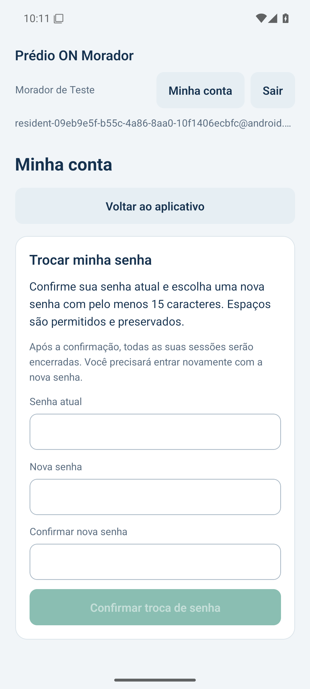

## Android — Operação · Segurança da conta

Origem: [CI1f7bd3d](https://github.com/helberjf/predioON/actions/runs/37157034870), artefato11285664020, APK Release x86_64 com assinatura efêmera de teste. Minha conta com campos protegidos vazios e confirmação desabilitada. 29 fases por app aprovadas contra API/PG/HTTPS reais: erro400 preserva sessão, troca204 revoga as próprias famílias, senha antiga401, nova literal200 e isolamento entre apps. É captura nativa de emulador Release, sem edição; aparelho físico e iOS autenticado pendentes. Um aviso MissingViewState permanece na jornada de senha da Operação; não houve crash/ANR. Hashes de imagem/APK e resultado no [registro](imagens/2026-10-03/android-password-evidence.json).

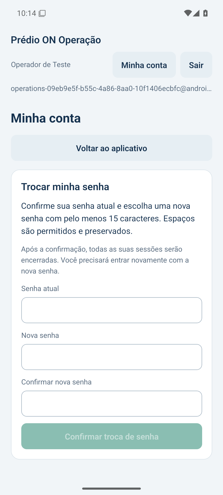
