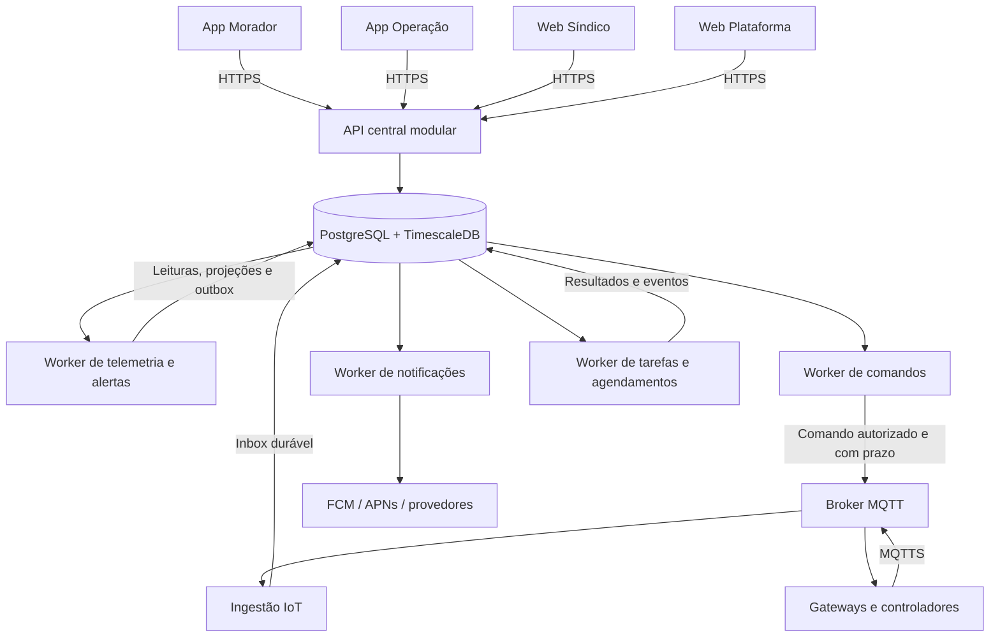

# Arquitetura de produto — Prédio ON

Data: 27/09/2026. Estado: proposta de arquitetura revisada a partir do código local; implementação pendente dos itens identificados como novos.

Esta referência substitui a proposta anterior de aplicativo conjunto de morador/síndico e aplicativo administrativo da plataforma. Define a evolução do produto completo, mantendo React Native **sem Expo**, plataforma central, banco centralizado e implantação inicial em uma VPS com Docker Compose. Não representa recursos já entregues, capacidade comprovada ou implantação em produção.

## 1. Produtos e responsabilidades

| Produto | Público | Responsabilidade |
|---|---|---|
| Prédio ON Morador — Android/iOS | Moradores | Experiência simples: avisos, solicitações, reservas, informações básicas, contas publicadas e acessos expressamente autorizados. Não expor configuração técnica ou dashboards de operação. |
| Prédio ON Operação — Android/iOS | Síndico e equipe de manutenção | Dashboards, alertas, sensores, equipamentos, ordens de serviço, automações e ações operacionais, conforme as permissões individuais. |
| Painel web do síndico | Síndico e gestores autorizados | Gestão completa do condomínio: usuários e equipes, configurações, relatórios, contas, regras, automações e rotina. |
| Painel web administrativo | Equipe da plataforma | Condomínios, clientes, planos, assinaturas, provisionamento, suporte, auditoria e saúde do serviço. |

Os aplicativos são produtos distintos, cada um com identificador, permissões do sistema e publicação próprios, compartilhando bibliotecas móveis. A identidade do usuário é central: uma pessoa pode usar os dois aplicativos sem duplicar sua conta. Entrar no aplicativo de operação não concede privilégios de síndico.

O portal web do morador existente permanece disponível por compatibilidade; não constitui um backend adicional. Não há aplicativo mobile administrativo da plataforma nesta arquitetura. Os quatro produtos principais compartilham os mesmos casos de uso e contratos de API.

## 2. Decisão arquitetural

Adotar **backend modular com processos separados por tipo de carga**. O código de negócio mantém fronteiras por domínio; os processos API, IoT e workers são unidades independentes de execução. Isso permite mover cargas entre servidores sem duplicar regras por aplicativo.

| Alternativa | Avaliação |
|---|---|
| Backend modular e processos por carga | Escolha: reaproveita Express/TypeScript e o banco atual, mantém transações locais e permite separar infraestrutura gradualmente. |
| Um processo para API, MQTT e tarefas | Menor configuração inicial, mas consultas, telemetria e trabalhos demorados competem pelo mesmo processo e ciclo de reinício. |
| Microserviço e banco próprios para cada domínio/aplicativo | Exigiria coordenação distribuída, sincronização e operação adicionais antes de haver necessidade comprovada. Não corresponde ao banco centralizado solicitado. |

Preparação para escala significa limites claros, autorização consistente, processamento recuperável, observabilidade e validação de capacidade. A primeira VPS continua sendo um ponto único de falha; containers separados não fornecem alta disponibilidade do servidor.



### 2.1 O que já existe e o que precisa evoluir

| Área | Evidência no repositório | Evolução necessária |
|---|---|---|
| Interfaces | Três projetos React/Vite e componentes web compartilhados | Dois projetos React Native, biblioteca móvel e cliente HTTP independente do navegador. |
| API | Express com módulos por domínio em `apps/api` | Separar regras hoje embutidas em rotas em casos de uso reutilizáveis por API e workers. |
| Tenant | `buildings`, `memberships`, contexto transacional e RLS | Permissões por capacidade, escopo de recurso e isolamento completo nas novas tabelas e filas. |
| Papéis | `PLATFORM_ADMIN`, `BUILDING_ADMIN`, `RESIDENT`, ordenados por `hasAtLeast` | Substituir hierarquia linear por RBAC explícito, incluindo manutenção e suporte. |
| Sessões | Argon2, JWT e refresh tokens armazenados por hash | Rotação atômica, famílias de sessão, revogação, MFA e armazenamento adequado a cada cliente. |
| Ingestão | MQTT, deduplicação, regras, consumo, offline e comandos no mesmo serviço | Separar recepção durável, processamento, comandos e tarefas; limitar concorrência. |
| Eventos | PostgreSQL LISTEN/NOTIFY e SSE | Outbox/inbox persistentes para trabalho obrigatório; sinais efêmeros apenas para atualização de tela. |
| Banco | API de negócio usa role restrita; autenticação/ingestão e outros caminhos usam conexão proprietária | Retirar credenciais de proprietário dos processos de aplicação e distribuir privilégios por carga. |
| Infraestrutura | Compose com API, ingestão, banco, broker e web; MQTT usa `clientId` fixo | Containers de workers, recursos limitados, migrações controladas e teste antes de múltiplas réplicas MQTT. |
| Comercial/manutenção | Organizações, funcionalidades e ocorrências já existem | Planos/assinaturas, equipes, ativos, ordens de serviço e motor de automações versionado são novos módulos. |

Os arquivos que fundamentam esse diagnóstico são `packages/shared/src/roles.ts`, `packages/db/src/context.ts`, `packages/db/src/index.ts`, `apps/api/src/auth/service.ts`, `services/ingest/src/index.ts`, `services/ingest/src/mqtt.ts` e `infrastructure/docker-compose.prod.yml`. O diagnóstico é por inspeção; não é uma nova execução dos testes históricos.

## 3. Monorepo proposto

Manter pnpm workspaces e a stack já existente. A árvore abaixo é o destino arquitetural, não uma relação de diretórios já criados.

```text
apps/
  api/                    HTTP, autenticação de requisições e composição dos módulos
  resident-mobile/        React Native: Prédio ON Morador
  operations-mobile/      React Native: Prédio ON Operação
  building-web/           React/Vite: gestão do condomínio
  admin-web/              React/Vite: administração da plataforma
  resident-web/           Portal atual preservado durante a evolução
services/
  ingest/                 MQTT: validação de entrada e persistência da inbox
  worker-telemetry/       Telemetria, projeções atuais, consumo e detecção de alertas
  worker-commands/        Publicação de comandos e ciclo de confirmação
  worker-notifications/   Push e integrações de mensagens
  worker-jobs/            Agendamentos, automações, relatórios e rotinas de manutenção
packages/
  contracts/              DTOs, schemas Zod e contratos públicos versionados
  domain/                 Módulos de negócio: modelo, casos de uso e interfaces de acesso
  db/                     Schema, repositórios PostgreSQL, RLS e migrações
  api-client/             HTTP, erros, paginação e renovação de sessão por adaptadores
  ui-web/                 Componentes React DOM
  ui-mobile/              Componentes React Native
  runtime/                Configuração de servidor, logs, métricas e execução de jobs
infrastructure/
  compose/                Definições de desenvolvimento e produção
  docker/                 Imagens e entrypoints
  mqtt/                   Configuração do broker e certificados montados
  observability/          Coleta de métricas e alertas operacionais
  backup/                 Rotinas de backup e restauração
docs/
  superpowers/specs/      Decisões e desenhos de arquitetura
  superpowers/plans/      Planos de implementação por entrega verificável
```

### Regras de dependência

- Aplicativos importam contratos, cliente HTTP e sua biblioteca de UI. Nunca importam banco, credenciais ou código de servidor.
- `domain` não depende de Express, MQTT, React ou Drizzle. Expõe casos de uso e interfaces de repositórios/provedores; os processos conectam as implementações.
- `db` implementa essas interfaces. Cada módulo é proprietário lógico de suas tabelas; outros módulos usam sua interface pública para alterações.
- `contracts` não exporta o schema interno do banco. DTOs públicos podem evoluir sem expor colunas sensíveis.
- `runtime` é exclusivo de servidor. Eventos entre módulos incluem versão e contexto; notificações não são disparadas diretamente por uma tela.
- Validar importações proibidas e ciclos no CI. Compartilhamento é explícito: não criar um pacote genérico que concentre toda a aplicação.
- Migrar `packages/shared` para contratos/domínio e `packages/ui` para UI web/cliente HTTP por etapas, com exportações de compatibilidade. Renomear pastas não é pré-requisito para começar nem justifica quebrar builds existentes.

## 4. Módulos do backend

| Módulo | Responsabilidade e limite |
|---|---|
| Identidade e sessões | Conta, credenciais, convites, recuperação, MFA, sessões e instalações de aplicativos. Não decide permissões de negócio sozinho. |
| Tenancy e imóveis | Condomínios, organizações comerciais, blocos, unidades, vínculos e fuso horário. |
| Autorização | Catálogo de permissões, papéis, concessões por condomínio, equipes e decisões de acesso. |
| Equipamentos e provisionamento | Ativos físicos, gateways, sensores, métricas, credenciais e capacidades suportadas pelo firmware. |
| Telemetria e consumo | Entrada normalizada, estado atual, histórico, qualidade, agregações e custos estimados. |
| Alertas | Regras, ocorrências de alerta, reconhecimento, resolução, cooldown e encaminhamento. |
| Comandos e acessos | Autorização, idempotência, expiração, envio e confirmação de ações físicas. Único caminho de atuação remota. |
| Automações | Regras versionadas com gatilho, condição e ações permitidas; simulação, ativação, execução e histórico. Não executa scripts arbitrários. |
| Manutenção | Equipes, ordens de serviço, responsáveis, checklists, anexos e histórico do ativo. Solicitação do morador e ordem de serviço são entidades diferentes e vinculáveis. |
| Convivência | Avisos, solicitações/ocorrências, respostas, áreas comuns, reservas e vagas. |
| Transparência e contas | Publicações da gestão e prestação de contas do condomínio. Não se confunde com cobrança da plataforma. |
| Comercial e funcionalidades | Planos versionados, assinaturas, limites e permissões de uso contratadas; integra-se ao controle operacional de funcionalidades existente. |
| Notificações e arquivos | Preferências, destinatários, entregas e metadados de arquivos; adaptadores para push, mensagens e armazenamento. |
| Suporte e auditoria | Atendimento da plataforma, concessão temporária para suporte, registros de acesso e trilha de alterações. |

A API é central e organizada por domínio, por exemplo `/v1/buildings/:buildingId/assets`, `/work-orders`, `/automations` e `/commands`. Não criar `/api-morador`, `/api-sindico` ou bancos diferentes para os aplicativos. Projeções de dashboard específicas de uma experiência são permitidas dentro da mesma API e política de autorização.

## 5. Tenant, banco central e entidades

### 5.1 Fronteira de isolamento

**Tenant operacional = condomínio/imóvel, identificado por `buildings.id`.** Preservar `building_id` nas tabelas existentes como identificador canônico; nos textos arquiteturais, tenant e condomínio referem-se à mesma fronteira. Não criar um `tenant_id` independente que possa divergir de `building_id`.

`organizations` reúne condomínios comercialmente. Pertencer a uma organização não concede acesso operacional a todos os seus imóveis. Um síndico profissional ou prestador recebe concessões explícitas para os condomínios que atende. A transferência comercial de um condomínio não move seus dados nem preserva automaticamente concessões da equipe anterior.

Dados globais de identidade e catálogo de planos têm políticas próprias. Faturamento comercial usa escopo de organização/assinatura; dados operacionais usam condomínio; auditoria da plataforma usa escopo de plataforma. Essa classificação deve estar explícita em cada tabela.

### 5.2 Entidades principais

| Domínio | Entidades existentes a preservar/evoluir | Novas entidades propostas |
|---|---|---|
| Identidade | `users`, `refresh_tokens` | `sessions`, `invitations`, `mfa_factors`, `mobile_installations` |
| Condomínio | `organizations`, `buildings`, `memberships` | `blocks`, `units`, `unit_memberships`, `teams`, `team_members` |
| RBAC | Papéis hoje embutidos em usuário/vínculo | `roles`, `permissions`, `role_permissions`, `role_bindings`, `support_grants` |
| Campo | `gateways`, `devices`, `device_metrics` | `assets`, `asset_device_links`, `gateway_credentials`, `device_capabilities` |
| Séries temporais | `ingest_events`, `telemetry`, `monitoring_profiles`, `usage_cursors`, `daily_usage` | `iot_inbox`, `device_latest_state`, projeções/agregações adicionais |
| Alertas e comandos | `alert_rules`, `alerts`, `gates`, `gate_commands` | Eventos de ciclo de alerta e tipos de comando adicionais somente para capacidades homologadas |
| Automações/manutenção | `occurrences`, `occurrence_events` | `automation_rules`, `automation_versions`, `automation_runs`, `work_orders`, `work_order_events`, `work_order_assignments` |
| Rotina/contas | `notices`, `notice_schedules`, `common_areas`, `reservations`, `parking_lots`, `financial_reports` | Metadados de anexos e vínculos às entidades proprietárias |
| Comercial | `global_feature_settings`, `building_feature_settings`, `feature_runtime` | `plans`, `plan_versions`, `plan_entitlements`, `subscriptions`, `subscription_events` |
| Mensagens e execução | Webhook de alerta e eventos efêmeros | `outbox_events`, `event_deliveries`, `jobs`, `notifications`, `notification_preferences`, `notification_deliveries` |
| Suporte/auditoria | `support_hosts`, `support_requests`, `audit_logs` | Histórico de concessões de suporte e eventos de administração comercial |

O catálogo acima não é uma migration a executar inteira. Cada entidade nova entra com seu módulo, políticas de acesso, índices, retenção e testes. Os IDs existentes permanecem válidos.

### 5.3 Integridade e crescimento do banco

- Toda entidade operacional nova carrega `building_id`; relações pai/filho usam chaves e validações que impedem relacionar recursos de condomínios diferentes. Acrescentar FKs compostas onde necessário, após verificar e corrigir os dados existentes.
- Vínculo de usuário com condomínio não é vínculo com unidade. Modelar múltiplas unidades, titularidade/ocupação e vigência sem duplicar a identidade do usuário.
- Criar índices a partir de consultas reais, normalmente incluindo condomínio, recurso e tempo. Limitar paginação, janelas de histórico, cardinalidade dos gráficos e exportações.
- Manter o estado atual em projeções pequenas; dashboards não devem procurar a última leitura em toda a série temporal. Armazenar `occurred_at`, `received_at`, qualidade e origem; leituras atrasadas não substituem estado mais recente.
- Separar histórico bruto, agregações, auditoria e arquivos. Configurar retenção por categoria/plano e medir seu custo; remoção do bruto não deve apagar agregações prometidas ao cliente.
- Preservar tabela normal de deduplicação. Índices únicos de hypertables têm restrições envolvendo colunas de particionamento; não pressupor unicidade global de `event_id` apenas no histórico. [Timescale](https://docs.timescale.com/use-timescale/latest/hypertables/hypertables-and-unique-indexes/).
- Armazenar dinheiro em centavos ou decimal exato. Manter estimativas de consumo identificadas como estimativas, separadas do faturamento comercial.
- Guardar metadados de arquivos no banco e conteúdo fora dele. Começar com volume persistente atrás de um adaptador privado de armazenamento e backup externo; a API autoriza downloads. A interface permite migrar para armazenamento de objetos sem mudar IDs públicos ou permissões. Não armazenar arquivos na camada gravável do container.
- Versionar registros editáveis para detectar alterações concorrentes; preservar revisões publicadas e auditoria de decisões.

## 6. Autenticação e autorização

### 6.1 Identidade central

- Manter Argon2 para senhas. Convites e recuperação usam tokens de uso único com expiração, armazenados por hash; não permitir que o cadastro público escolha papéis privilegiados.
- Access token curto, inicialmente cinco minutos, identifica `sub`, sessão, emissor, audiência e expiração. Consultar estado atual da sessão/conta e concessões no servidor; a duração do JWT não define sozinha o prazo de revogação.
- Migrar a assinatura de HS256 para chave assimétrica com `kid` e rotação. Só identidade assina; consumidores verificam com chave pública. Durante a migração, aceitar os tokens antigos por uma janela limitada e predeterminada, sem ampliar suas permissões.
- Refresh token opaco, por instalação/sessão, com família, hash e expiração. Rotação e consumo do token anterior acontecem na mesma transação com trava/compare-and-swap. Reutilização invalida a família; o cliente serializa renovações e trata perda da resposta solicitando novo login quando necessário.
- Sessões da web e dos aplicativos são independentes. Permitir listar/revogar dispositivos e revogar todas as sessões na recuperação de conta ou incidente.
- Web: access token em memória e refresh em cookie `HttpOnly`, `Secure`, escopo de host/caminho restrito, proteção CSRF e validação de origem. Migrar o armazenamento atual em `localStorage` sem presumir que ele já foi substituído.
- Mobile: refresh em Keychain/Keystore por adaptador seguro e access token em memória. Nenhum segredo de serviço dentro do aplicativo.
- MFA obrigatório para administração da plataforma e concessão/execução de ações privilegiadas do síndico; exigir nova verificação para elevar acesso, mudar credenciais de campo e alterar automações de atuação. Aplicar limites a tentativas de login/recuperação.

### 6.2 RBAC com escopo e condições de recurso

Substituir `hasAtLeast` por avaliação explícita: **sujeito + ação + condomínio/escopo + recurso + condições atuais**. Papéis são conjuntos de permissões, não degraus de uma hierarquia global.

| Papel inicial | Permissões típicas | Limites |
|---|---|---|
| Morador | Avisos publicados, próprios chamados/reservas e informações autorizadas; solicitar acesso concedido | Sem cadastro técnico, contas de terceiros ou configuração de automações. |
| Síndico | Gestão do condomínio, equipe, operação, relatórios e automações autorizadas | Somente condomínios concedidos; atribui apenas papéis/permissões delegáveis dentro desse escopo. |
| Manutenção | Leituras e alertas necessários, ordens atribuídas e registro de execução | Sem financeiro, gestão de usuários ou edição livre de automações; comandos físicos requerem concessão própria. |
| Gestor de manutenção | Distribuir ordens e supervisionar a equipe nos condomínios concedidos | Não recebe automaticamente poderes de síndico. |
| Suporte da plataforma | Diagnóstico e atendimento autorizado | Acesso ao condomínio por concessão temporária, com motivo, prazo e auditoria; sem personificação silenciosa do usuário. |
| Administrador da plataforma | Clientes, planos, provisionamento e administração global autorizada | Permissões globais explícitas; leitura de conteúdo privado e atuação física não vêm de um bypass universal. |

Exemplos de permissões: `telemetry:read`, `alerts:acknowledge`, `work-orders:assign`, `work-orders:update-assigned`, `devices:configure`, `commands:request`, `automations:manage`, `finance:read`, `memberships:manage`, `plans:manage`, `support:grant`.

A autorização de uma ação exige conta/sessão ativa, vínculo vigente, permissão, escopo compatível, condição do recurso e disponibilidade operacional. Plano contratado e feature flag não substituem permissão do usuário. Campos e consultas também são filtrados: permissão para uma ordem de serviço não autoriza ler toda a lista de moradores.

No contexto de operações do condomínio, papéis delegáveis pertencem a esse condomínio. Escopo de plataforma é separado e não pode ser atribuído por síndicos. Atribuições a equipes expiram/revogam com seus vínculos e são reavaliadas quando a ordem ou o equipamento muda de escopo.

### 6.3 Defesa no banco

- API usa role não proprietária e sem `BYPASSRLS`; contexto de identidade/condomínio vive apenas na transação. `buildingId` informado pelo cliente é validado, nunca prova de autorização.
- Política padrão é negar; implementar `USING` e `WITH CHECK` conforme a operação. Testar acesso sem filtro na aplicação e relações cruzadas entre tenants.
- Helpers `SECURITY DEFINER` têm dono restrito, `search_path` fixo e privilégios de execução limitados. Revisar uso de `FORCE ROW LEVEL SECURITY` para não introduzir recursão nas consultas de vínculos.
- Separar roles de identidade, API, entrada IoT, telemetria, comandos, jobs e migrações. Processos de runtime não recebem a senha do proprietário. Workers recebem somente acesso às filas e interfaces/tabelas necessárias à carga, validando o tenant de cada trabalho.
- Auditoria é de acréscimo: aplicação pode inserir, não editar/apagar o histórico. Registrar ator real, concessão usada, tenant, recurso, resultado e correlação; não registrar tokens, senhas ou payloads pessoais completos.

O PostgreSQL distingue políticas RLS de privilégios de proprietário/superusuário; habilitar RLS sozinho não restringe esses acessos. [Documentação PostgreSQL 16](https://www.postgresql.org/docs/16/ddl-rowsecurity.html).

## 7. Comunicação IoT e comandos

### 7.1 Entrada confiável

1. Gateway coleta sensores com identidade, versão de contrato e horários; mantém buffer limitado de telemetria para falhas de conexão.
2. Conecta ao broker por MQTTS validando certificado. Provisionamento emite credencial individual, com rotação/revogação; suportar certificado de cliente por gateway conforme o hardware homologado.
3. ACL vincula identidade autenticada a gateway, condomínio e dispositivos. Publicar um `buildingId` no payload não concede acesso. Credenciais humanas nunca são credenciais MQTT.
4. Ingestão verifica tamanho, tópico, schema, vínculo, qualidade e limites de taxa. Persistir mensagem válida em inbox antes de confirmar seu processamento de transporte; mensagens inválidas são rejeitadas ou registradas em quarentena limitada, sem retentativa infinita.
5. Worker de telemetria normaliza e persiste leituras, atualiza estado atual, calcula consumo e avalia alertas. Alterações e eventos de domínio entram na mesma transação. Duplicatas não repetem cálculo nem alertas.
6. Workers de automações/notificações processam os eventos comprometidos. Falha em um provedor de push não bloqueia a ingestão.

A inbox distingue telemetria, status e confirmação de comando. O worker de telemetria trata leituras/status; o worker de comandos trata ACKs em fila própria, com prioridade e deduplicação, para que um acúmulo de histórico não atrase a confirmação de uma ação. A verificação de equipamentos sem comunicação é uma tarefa agendada, usando o horário de recebimento e os limites configurados.

Preservar os tópicos atuais durante a migração (`predio/{buildingId}/device/{deviceId}/telemetry`, tópico compacto de água, status e acessos). Versionar schemas de payload e manter adaptadores para firmware antigo. Introduzir tópicos novos somente quando houver incompatibilidade real e migração de firmware definida.

A chave de deduplicação do novo envelope inclui identidade do gateway e `eventId`; ordem usa sequência/época de inicialização quando disponível. Consumo precisa serialização por dispositivo/métrica e política para mensagens atrasadas. O período de retenção da deduplicação cobre a janela máxima aceita de replay.

Durante a migração, a validação de funcionalidades continua sendo autoritativa no servidor. Uma pausa operacional mantém os efeitos atuais documentados — descarte das leituras correspondentes e suspensão de processamento/alertas —, sem permitir que o novo buffer as reintroduza depois. Registrar geração de configuração e revalidá-la no consumo da inbox; heartbeat permanece independente. Isso não se aplica automaticamente a alterações comerciais do plano.

**Ponto a corrigir no código atual:** o listener `message` inicia uma Promise sem aguardá-la no fluxo de confirmação MQTT. QoS 1 e `clean: false` não comprovam persistência no PostgreSQL. Usar o mecanismo de controle de processamento/backpressure da versão de mqtt.js adotada e provar, em teste com interrupção do processo, a fronteira entre commit e ACK. [mqtt.js](https://github.com/mqttjs/MQTT.js#api).

Inicialmente manter uma instância de recepção, com sessão estável e buffer persistente no broker. Escalar primeiro consumidores da inbox. Para múltiplos receptores, usar IDs distintos e particionamento ou assinaturas compartilhadas validadas na versão/edição do broker; testar ordenação, persistência e recuperação, sem assumir que replicar o container distribui mensagens corretamente. O `MQTT_CLIENT_ID` fixo atual precisa ser tratado antes dessa mudança.

Heartbeat e Last Will representam comunicação; leitura antiga representa qualidade/frescor do sensor. Preservar essa distinção, evitando que um gateway conectado torne todas as leituras aparentemente recentes.

### 7.2 Atuação física e automações

- Somente o módulo de comandos cria uma solicitação física. Aplicativo, automação e worker nunca publicam diretamente um comando MQTT fora desse fluxo.
- Comando possui identificador, tenant, alvo, solicitante humano/serviço, ação permitida, criação, prazo e versão de configuração. Revalidar autorização, concessão, recurso e comunicação antes do envio.
- Preservar para abertura de portões a política já implementada: QoS 0, `retain: false`, fila de saída desativada, expiração e ausência de reenvio automático após reconexão. O modelo de retentativa das notificações não se aplica à atuação física.
- Preservar os estados atuais de pedido/envio/confirmação/falha/expiração e o ACK correlacionado ao controlador. Confirmação de execução não mede posição física; falta de ACK não autoriza repetir a ação.
- Automações possuem versões imutáveis publicadas, gatilho, condição, ação, cooldown e histórico de execução. Começam desativadas, permitem simulação e só usam capacidades homologadas: notificar, criar ordem de serviço e solicitar comandos suportados.
- Executar automações por identidade de serviço limitada ao condomínio e às ações concedidas, nunca pelo JWT armazenado de um síndico. Revalidar habilitação, autorização e versão antes de atuar.
- Telemetria atrasada, qualidade inválida ou replay histórico não dispara atuação física. Prevenir ciclos, rajadas e execuções simultâneas incompatíveis no mesmo equipamento.
- Não ampliar os comandos físicos atuais para equipamentos sem contrato e teste de firmware. Intertravamentos e operação local permanecem no controlador quando a internet está indisponível.

## 8. Eventos, filas, notificações e API

### 8.1 Processamento durável no banco central

Começar com inbox, outbox e filas no PostgreSQL, sem dependência obrigatória de Redis/RabbitMQ/Kafka. O contrato de fila fica atrás de interface para permitir extrair seu transporte se medições demonstrarem necessidade.

- Alteração de negócio e evento de outbox são gravados na mesma transação. Envelope contém ID, tipo/versão, tenant, agregado, instante e correlação; payload referencia recursos e evita copiar dados sensíveis.
- Cada consumidor tem seu próprio registro de entrega. Um evento destinado a notificações e automações não pode ser removido globalmente pelo primeiro consumidor.
- Jobs usam reserva atômica com `FOR UPDATE SKIP LOCKED`, lease com prazo, contador de tentativas e próximo horário. Confirmar conclusão somente se o worker ainda possuir a reserva. Não manter transação aberta durante chamadas externas.
- Efeitos são idempotentes por evento/consumidor/ação. Retentativa com atraso exponencial limitado e tratamento de falhas definitivas; trabalhos esgotados permanecem inspecionáveis para reprocessamento auditado. Não prometer entrega exatamente uma vez.
- Scheduler persiste ocorrências futuras, considera o fuso do condomínio e usa unicidade por regra/instante. Reinícios e duas instâncias não duplicam avisos, relatórios ou automações.
- Retenção e limpeza são separadas por inbox, eventos entregues e falhas. Definir quotas por tenant e concorrência por tipo de carga para impedir monopolização da VPS.

PostgreSQL `NOTIFY` pode acordar consumidores e atualizar interfaces, mas a fila persistida continua sendo a fonte de verdade. Eventos perdidos durante uma desconexão devem ser recuperáveis por consulta. [PostgreSQL NOTIFY](https://www.postgresql.org/docs/16/sql-notify.html).

### 8.2 Notificações

Usar FCM com APNs para os dois aplicativos React Native, com credenciais/identificadores próprios por produto e ambiente. Registrar instalação, usuário, família de sessão, aplicativo, plataforma e token. Revogar o vínculo quando a sessão for revogada e atualizar o registro quando o token mudar.

Destinatários são calculados no servidor, com concessões atuais e preferências por categoria. Morador recebe avisos e mudanças pertinentes em suas solicitações/reservas; operação recebe alertas e trabalhos de seu escopo. Suporte da plataforma recebe eventos de seus atendimentos, sem repassar conteúdo privado ao aplicativo de moradores.

O push sinaliza que há uma atualização; não substitui histórico nem transporte de comando. Sua entrega depende de permissões, sistema operacional e rede. Abertura da notificação consulta novamente a API e exige autorização, inclusive após troca de condomínio ou revogação. Manter mensagens discretas na tela bloqueada.

### 8.3 Contratos dos clientes

- Introduzir `/v1` com contratos documentados e schemas compartilhados. Manter rotas existentes por adaptadores durante a migração, com prazo de descontinuação registrado quando os consumidores migrarem.
- Erros possuem código estável, mensagem e identificador de correlação. Listas têm limite e paginação; alterações concorrentes usam versão. Operações com risco de duplicação recebem chave de idempotência vinculada a usuário, tenant, operação e conteúdo.
- Mobile continua compatível com versões anteriores suportadas: não depender de atualização imediata pelas lojas. Alterações aditivas precedem remoção; comunicar requisitos mínimos de versão.
- API não mantém sessão, jobs ou arquivos exclusivamente na memória/disco do container. Cache, quando necessário, inclui tenant, identidade/escopo e versão de autorização.
- Preservar SSE na web com reconsulta após reconexão; migrar token na URL para mecanismo de autenticação de stream sem credencial duradoura em logs. Mobile usa atualização da tela ativa e push; a cadência inicial de consulta é 15 s, pausada em segundo plano, e pode ser reduzida por evento/uso medido.

## 9. Planos, assinatura e funcionalidades

Catálogo de planos é global e versionado; assinatura pertence a um condomínio e referencia uma versão do plano. A organização é o agrupador comercial/pagador. Mudanças de plano geram histórico e data de vigência, sem alterar retroativamente contratos já associados.

Entitlements definem módulos e quotas contratados. Manter separados: direito comercial, feature flag global/local, permissão do usuário e estado operacional do equipamento. A existência de plano superior nunca concede papel de administrador.

Quotas de gateway, dispositivos, usuários ou armazenamento são verificadas no servidor, inclusive em operações concorrentes. Exibir uso no administrador e no painel do síndico conforme autorização. Exportações e consultas também têm limites por tenant.

Inadimplência ou vencimento não executa a pausa operacional de sensores nem modifica portões automaticamente. Qualquer suspensão operacional exige política explícita e ação auditada. Isso evita misturar cobrança com os efeitos destrutivos de ingestão pausada já documentados em funcionalidades.

Gestão de planos/assinaturas entra no produto; cobrança automática por um provedor é uma integração separada. Seu contrato deverá incluir verificação de assinatura de webhooks e idempotência. Contas do condomínio continuam no módulo de transparência, sem reaproveitar suas tabelas para faturar o SaaS.

## 10. Implantação inicial em uma VPS

Usar Docker Compose de produção com imagens imutáveis e configuração externa. O modelo de servidor único é suportado pelo Compose; continuidade após perda desse servidor exige backup/restauração ou infraestrutura redundante. [Docker](https://docs.docker.com/compose/how-tos/production/).

| Container/processo | Carga | Possível extração posterior |
|---|---|---|
| `web` / Caddy | TLS, arquivos estáticos e proxy | CDN/hospedagem estática e balanceador |
| `api` | HTTP e streams, sem jobs demorados | Réplicas atrás de balanceador |
| `ingest` | Conexões MQTT e inbox | Host de entrada IoT; múltiplos receptores após teste específico |
| `worker-telemetry` | Leituras, projeções e alertas | Réplicas/partições por gateway ou dispositivo |
| `worker-commands` | Publicação e controle de comandos | Host de operação com limites de conexão e exclusão por alvo |
| `worker-notifications` | Integrações externas | Réplicas por provedor/quota |
| `worker-jobs` | Scheduler, automações, relatórios e manutenção | Separar tarefas caras por fila/processo |
| `db` | PostgreSQL/TimescaleDB e filas | Servidor dedicado ou serviço compatível com as extensões usadas |
| `emqx` | Transporte IoT | Host/cluster dedicado, após validar edição e persistência |
| Migração/backup | Comandos executados sob demanda/agendamento | Executor de deploy e armazenamento externo |

Os workers podem usar uma imagem comum com entrypoints e limites de recursos separados. Não precisam de repositórios nem pipelines completamente distintos para cada processo.

### Condições para operar e crescer

- Expor somente HTTPS e MQTTS; dashboards internos, banco e métricas ficam na rede privada, acessíveis por canal administrativo controlado. Serviços usam nomes DNS/configuração, não `localhost` de outro container.
- Fixar versões/digests de imagens; substituir o uso atual de `latest-pg16` ao implementar a implantação revisada. Reservar CPU/memória/IO e pools de conexão por processo; considerar a soma dos pools e a carga de WAL.
- Aplicar migrations versionadas uma vez por release, por executor exclusivo. O `drizzle-kit push --force` do bootstrap atual deve ser substituído no fluxo de atualização de produção por migrations revisadas e registradas. Nunca executar reset/seed demonstrativo para atualizar dados reais.
- Adotar migração expandir/preencher/validar/trocar/remover, com compatibilidade temporária entre versões. Não assumir que rollback de código desfaz uma migração de dados.
- Configurar encerramento gracioso e health/readiness específicos: API pronta para atender, ingest conectado/gravando e workers renovando leases. Contadores de processo vivo não provam processamento saudável.
- Backup externo e criptografado de banco/arquivos/configuração recuperável; arquivamento de WAL quando necessário para recuperação pontual. Provar restauração em ambiente isolado, inclusive permissões e extensão TimescaleDB.
- Objetivos iniciais de recuperação: RPO de até 15 minutos e RTO de até 4 horas, tratados como metas a validar em ensaio, não como garantia contratual já alcançada.
- Logs estruturados com correlação; métricas de latência HTTP, conexões, lag da inbox, idade da outbox, falhas de jobs, ACK de comandos, armazenamento, certificados e backup. Evitar labels por usuário/dispositivo que causem cardinalidade ilimitada.
- Logs e métricas básicos começam desde a primeira implantação; coleta externa de disponibilidade permite detectar queda total da VPS. Testar que relatórios e notificações lentos não paralisam leituras ou operação.

### Dimensionamento e extração

Não estimar capacidade somente pelo número de condomínios. Medir gateways, métricas por mensagem, frequência, usuários simultâneos, janela de histórico e retenção. Exemplo de orçamento de carga: 100 condomínios × 20 dispositivos × 1 mensagem a cada 10 s = 200 mensagens/s; várias métricas por mensagem multiplicam as linhas e os índices. Isso é cenário de teste, não capacidade prometida da VPS.

Extrair a carga quando medições mostrarem contenção: primeiro relatórios/agregações e notificações, depois API/recepção IoT e infraestrutura de banco/broker conforme o gargalo. A ordem pode ser ajustada pelos dados; contratos, autorização e propriedade lógica das tabelas permanecem os mesmos.

Banco continua central ao mover processos. Filas, arquivos e broker deixam de depender do host da API; conexões entre hosts passam a usar rede privada e transporte protegido. Microserviços por domínio só se justificam depois por isolamento operacional/equipe e limites medidos, não pelo número de aplicativos.

## 11. Evolução do código existente

Estas etapas são a sequência de implementação do produto completo, com critérios de saída; não reduzem seu escopo a uma versão demonstrativa.

| Etapa | Mudança | Critério de saída |
|---|---|---|
| 1. Contratos e fronteiras | Separar cliente HTTP/UI, definir DTOs, módulos e testes de dependência | Web existente continua funcional; módulos não importam UI/transporte indevidamente. |
| 2. Identidade e RBAC | Sessões, rotação atômica, papéis/permissões, unidades/equipes, RLS e roles de banco | Testes negativos entre tenants e perfis; manutenção opera sem herdar poderes de síndico. |
| 3. Processamento | Inbox/outbox, leases, telemetria/comandos/notificações/jobs separados | Reinício recupera trabalho; duplicatas não repetem efeitos; comando expirado nunca é reenviado. |
| 4. Domínios de produto | Ativos, manutenção, automações, planos/assinaturas e suporte temporário | Fluxos completos e auditoria; nenhuma duplicação de regra por cliente. |
| 5. Experiências | Apps Morador/Operação em React Native sem Expo e painéis web ampliados | Escopo de cada produto respeitado, push contextual e testes em Android/iOS. |
| 6. Operação | Compose revisado, migrations, backup, observabilidade e ensaio de carga | Restauração comprovada, limites medidos, procedimentos de atualização e incidentes testados. |

Migrar papéis antigos de forma explícita: `RESIDENT` para permissões de morador; `BUILDING_ADMIN` para papel de síndico no respectivo condomínio; `PLATFORM_ADMIN` para papel administrativo global. Revisar permissões de leitura privada/atuação antes de preservar qualquer acesso amplo. O backfill deve respeitar vínculos inativos e datas de vigência.

Na transição de processadores, cada partição/carga tem um proprietário ativo. Desativar o processamento antigo correspondente antes de habilitar o novo, com buffer/drain e reconciliação; não executar dois motores de consumo/alertas sobre a mesma leitura sem deduplicação compartilhada. Comparação em sombra pode calcular resultados, mas não produzir comandos ou notificações.

## 12. Critérios de aceite e pontos que evitam retrabalho

- Usuário síndico no condomínio A e morador no B não transfere permissões entre eles; manutenção não consulta financeiro nem altera usuários. Testar concessões expiradas, conta desativada e acesso direto a IDs de outro condomínio.
- Duas requisições concorrentes não consomem o mesmo refresh token com sucesso. Troca de senha/revogação encerra a família de sessões e instalações vinculadas.
- Nenhum processo de runtime usa credencial de proprietário; conferir políticas no banco, não apenas respostas filtradas pela API.
- Mensagem MQTT repetida, atrasada, fora de ordem, malformada ou recebida durante queda do banco tem resultado definido. Provar reinício entre recebimento, commit e confirmação.
- Dois workers/schedulers não duplicam consumo, publicação de aviso, ordem automática nem comando. Testar queda após efeito externo antes de marcar a entrega como concluída.
- Portão preserva prazo, política sem replay e confirmação do controlador. Toda automação deixa trilha de versão, gatilho e autorização; nenhum replay de histórico produz atuação.
- App Morador não recebe dados técnicos/privados por push ou API; App Operação respeita o papel de cada colaborador. Instalação revogada deixa de receber conteúdo autorizado a outra sessão.
- Alterações de plano não elevam RBAC nem pausam sensores silenciosamente. Limites concorrentes e mudanças de vigência são auditados.
- API continua compatível com versões mobile suportadas e com firmware antigo durante a janela de migração.
- Testar carga com consultas e telemetria simultâneas, atraso de provedor, banco lento, disco próximo do limite e reinício da VPS. Registrar latência, perda/repetição, crescimento de filas e consumo real; metas de capacidade são aprovadas a partir desses resultados.
- Backup somente conta como recuperação quando restaurado e verificado. Atualização de imagens/bibliotecas ocorre em janelas planejadas, com correções urgentes de segurança fora da janela quando necessário.

Não reescrever o produto inteiro para reorganizar pastas; não derivar autorização do nome do aplicativo; não usar um papel global ordenado como substituto de escopo; não ligar desempenho de consultas à varredura do histórico bruto; não usar `NOTIFY` como fila durável; não supor que QoS MQTT confirma a transação de negócio; não aplicar política de retry de jobs a comandos físicos.

## 13. Estado desta atualização

Esta atualização entrega a especificação e os vínculos na documentação do projeto. Novos aplicativos, entidades, permissões, workers, automações e planos ainda exigem implementação e validação. Os procedimentos e evidências anteriores continuam descrevendo exclusivamente a versão existente. A divisão de produtos e as decisões arquiteturais deste documento têm precedência sobre propostas anteriores de evolução mobile.
